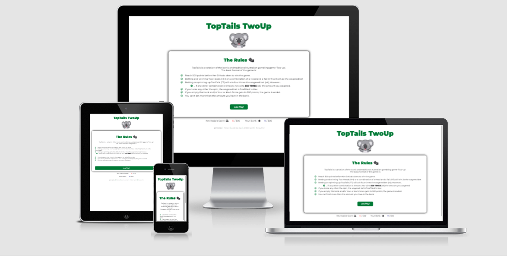
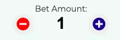
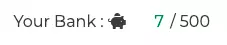
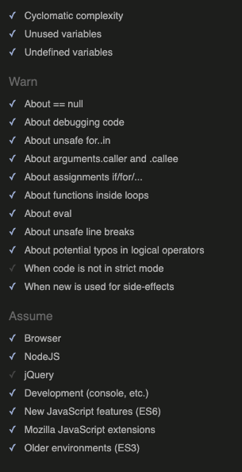
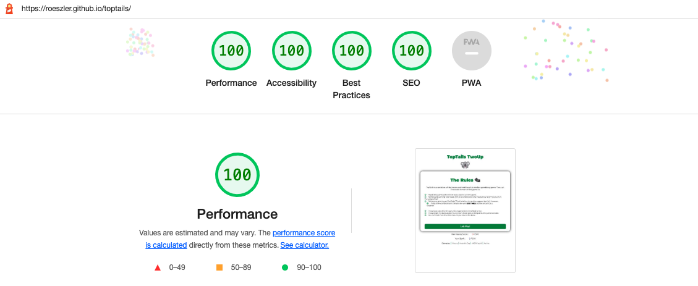

# TopTails TwoUp
### HTML, CSS and JavaScript Essentials - Portfolio Project 2
Site link : https://roeszler.github.io/toptails/

Table of Contents (dropdown list)

1. [Project Purpose](#1-project-purpose)
2. [User Experience Design](#2-user-experience-design)
    * [User Stories](#user-stories)
        * [First Time Visitor Goals](#first-time-visitors)
        * [Returning Visitor Goals](#returning-visitors)
        * [Coding Colleagues](#coding-colleagues)
    * [Design](#design)
        * [Imagery](#imagery)
        * [Fonts](#fonts)
        * [Color Scheme](#color-scheme)
        * [Site Mockup & Wireframe](#site-mockup--wireframe)
3. [Features](#3-features)
    * [Existing Features](#existing-features)
        * [Splash Screen (Gameplay & Rules)](#splash-screen--rules)
        * [Game Area](#game-area)
        * [Bet Amount Area](#bet-amount-area)
        * [Bet Type Area](#bet-type-area)
        * [Spin Button](#spin-button)
        * [Score Area](#score--bank-balance-area)
        * [Footer](#footer)
        * [PopUps](#popups-modals)
        * [Record User Choices](#choice-html)
    * [Future Features](#possible-future-features)
4. [Technologies](#4-technologies)
    * [Tools](#tools)
    * [Browsers](#supported-screens-and-browsers)
5. [Testing](#5-testing)
    * [Issues and Resolutions](#issues--resolutions)
    * [Validator Testing](#validator-testing)
6. [Deployment](#6-deployment)
    * [Display Environment](#display-environment-github--gitlab--bitbucket)
    * [Development Environment](#development-environment-gitpod)
7. [Credits](#7-credits)
    * [Content](#content)
    * [Media](#media)

## 1. Project Purpose

The TwoTails website was created as the second part of my project portfolio while styling the [Code Insitute's Full Stack Software Developer course](https://codeinstitute.net/se/full-stack-software-development-diploma/). It has been built from the ground up to extend myself, demonstrate the use of JavaScript (vanilla JavaScript), HTML and CSS employing User Centred Design and have some fun. The site is targeted to those looking to implement similar advanced JavaScript concepts, while also participating in a fun game of chance. 

TopTails is a fully responsive game that allows users to bet, choose and chance their luck at winning against a virtual opponent (Kev the Koala) and beating him to 500 points.  

## 2. User Experience Design

TopTails TwoUp (or TopTails for short) is a site that hopes to convey a variation of the iconic and traditional Australian gambling game 'Two-up' and the rich history that it surrounds. 

As a game of chance, TopTails allows users to betting on the outcome of two pennies 'virtually thrown' in the air. Typically played in conjunction with the Australian national remembrance of the [ANZAC spirit](https://en.wikipedia.org/wiki/Anzac_Day), it also represents a game often played at a period of time Australia first displayed itself as distinctly separate nation on the global stage. You may read more about this [here](https://en.wikipedia.org/wiki/Two-up) (Hold CTRL to open in new tab).

The User Experience Design (UXD) seen in TopTails has been underpinned by a recognised User Centered Design (UCD) process. A framework of each step in this UCD process has been devloped from the authors experience in business planning and modules studied Code Institute's [Diploma in Full Stack Software Development](https://codeinstitute.net/se/full-stack-software-development-diploma/). The framework followed can be seen in the attached documentation: 
1. [Strategy Plane](assets/ucd/1-strategy.md)
2. [Scope Plane](assets/ucd/2-scope.md)
3. [Structure Plane](assets/ucd/3-structure.md)
4. [Skeleton Plane](assets/ucd/4-skeleton.md)
5. [Surface Plane](assets/ucd/5-surface.md)

### User Stories
#### First Time Visitors
* As a first time user, I wan't to quickly understand the purpose of the site.
* As a first time user, I wan't to understand the rules of the game.
* As a first time user, I wan't to understand how the game is ended.
* As a first time user, I wan't to identify that it is a game of chance.
* As a first time user, I wan't to be able to select choices in a simple and intuitive way.
* As a first time user, I wan't to initiate the game play in a simple and intuitive way.
* As a first time user, I wan't the game to require interaction with me.
* As a first time user, I wan't ways to learn more about the author, topic and history surrounding the game.
* As a first time user, I wan't ways to refer the game to my friends.
#### Returning Visitors
* As a returning user, I wan't to try to beat the computerised opponent (Kev the Koala) to 500 points without breaking the bank.
* As a returning user, I wan't to engage with [game theory](https://en.wikipedia.org/wiki/Game_theory) as a pastime to beat a virtual opponent.

#### Coding Colleagues
* As a fellow code writing user, I wan't to see how the java script has been written and operates.
* As a fellow code writing user, I wan't to be able to contact the author.
### Design

  The site is intended to convey items commonly used in close association to the Australian land, lifestyle and culture.
#### Imagery

  Australia is commonly associated with the Kangaroo, the Emu (found on its [coat of arms](https://en.wikipedia.org/wiki/Coat_of_arms_of_Australia)) and the Koala in [popular culture](https://www.australiangeographic.com.au/topics/wildlife/2014/08/australias-animal-fauna-emblems/).

  A deliberate focus on the imagery of TopTails is to convey a fun, light and intuitively warming experience to the user. On search of appropriately available imagery, the Koala was chosen based on its often inferred 'cuddly' nature. From here, Kevin the Koala was chosen as a name for the opponent, as it attaches to the site imagery and natural alliteration that occurs from its name.

#### Fonts
Typography was evaluated in line with the site style aiming for a the easy to read, recreational visitor.
* Bold, fun and slightly quirky main headings
* Smooth easy to read content 
* Excellent contrast 
* Adequately convey the light, fun, simple gameplay of site
  
Typography selection process :
* Review of similar and complementary fonts from variety of internet based sources
* Selection of those that seem appropriate to the game design
  * Shortlisted fonts :
    * Alfa Slab / Open Sans
    * Alegreya Sans / Roboto
    * Montserrat / Montserrat

Evaluation based on contrast, easy of reading, and shapes that compliment the Australian nature, the singular font style [Montserrat](https://fonts.google.com/specimen/Montserrat) was selected as the font most suitable. 

#### Color Scheme

Based on providing visual depth and variety of events to the game user, the following color palette has been chosen surrounding the green seen in the [Australian national colours](https://en.wikipedia.org/wiki/National_colours_of_Australia), bright yellow and flag blue: 

| Primary Color Palette | Hexadecimal Value | RGBA Value  |
| - |:-:| -:|
| Text Gray | #000000E6 | rgba(0,0,0, 0.9) |
| Inactive Gray | #3B3B3F | rgba(59,59,63, 0.2) |
| Australian Green | #00843D | rgba(0,140,60, 1) |
| Fade Australian Green | #00843D80 | rgba(0,140,60, 0.5) |
| Dark Australian Green | #006400 | rgba(0,100,0, 1) |
| Game Area Green | #00843D0D | rgba(0,140,60, 0.05) |
| Australian Flag Blue | #00008B | rgba(0,0,139, 1) |
| Yellow | #ff0 | rgba(255,255,0,1) |
| Red | #FF0000 | rgba(255,0,0,1) |
| White | #FFF | rgba(255,255,255,1) |
| Black | #000 | rgba(0,0,0,1) |
| Silver | #c0c0c0 | rgba(192,192,192,1) |

#### Site Mockup & Wireframe

The feel and function of the wireframes is the initial framework of the site. It is intended to show stakeholders and potential clients early concepts before any coding started.

Contained in the [TopTails Wireframe.pdf](assets/images/docs/TopTailsWireframe.pdf) document is a visualisation of the layout and simple colouring intended for the site.

The wireframe are intended to convey :
- An indication of the various elements and positions of these in relation to each other.
- The actions / content that gets priority via it's location on the screen, actions, animations and embedded interactivity.
- What is encountered at different stages of the site.
- Illustrate the more technical requirements in the site to achieve an easy and intuitive navigation to the primary goals of the stakeholders in the site.
- Convey a sense of the user experience planned for the site as users navigate.

## 3. Features 

In this section, you should go over the different parts of your project, and describe each in a sentence or so. You will need to explain what value each of the features provides for the user, focusing on who this website is for, what it is that they want to achieve and how your project is the best way to help them achieve these things.

### Existing Features
#### Splash Screen & Rules
  * The first page of the site is intended to ground the user into the objective and game rules.
  * TopTails gameplay is a simplified variation to the original TwoUp rules as described [here](https://en.wikipedia.org/wiki/Two-up#Gameplay).
  * It helps fulfil two user stories: 
    > As a first time user, I wan't to quickly understand the purpose of the site.
    
    > As a first time user, I wan't to understand the rules of the game.

  * It intuitively indicates that a new game has commenced.
  * It provides encouragement to the user to start / restart the game. 

  
#### Game Area
  * This is the main interaction portion of the site. 
  * It contains all sections contained within the body; Heading, Game Area, Score Area and Footer.
  * As an alternative to using `alert()` functions, I have coded functions to simultaneously display events as a [popup](#popups)) and hide the game area. 
    * This has been done to maintain interactivity across mobile devices and browsers that often block traditional `alert()` style events.
  * The game area holds the multiple points of interaction discussed under the headings underneath.
  * It is bound by a subtle green coloration to delineate the focal points of gameplay and intuitively indicate to the user where to interact with the site.
  * It maintains the primary green / yellow color scheme commonly seen in [Australian sports](https://en.wikipedia.org/wiki/National_colours_of_Australia).
  * It also helps the user eye to focus, and is replaced in the exact dimensions with game events ([popups](#popups)).
  * It attends to user stories:
    > As a first time user, I wan't to be able to select choices in a simple and intuitive way.
    
    > As a first time user, I wan't to initiate the game play in a simple and intuitive way.
    
    > As a first time user, I wan't the game to require interaction with me.
    
    > As a first time user, I wan't to understand how the game is ended.

#### Bet Amount Area

  * This section is the first point of user interaction.
  * Allows user to increment / decrement the bet amount that simultaneously decreases / increases the bank area seen as 'Your Bank'.
  * Creates a sense of risk vs reward that is vital for making chance games fun and even compelling.
  * It has been created as an `<input type="number">` tag without the usual increase/decrease arrows that associate with this input. 
    * Although not conventional, the use of the 'un-styled' input button has permitted :
      * Logging of amounts to console, 
      * Direct user input (if so desired),
      * Event listener on the DOMContentLoaded event that fundamentally controls the game, 
      * Simultaneous decreasing of a similar `<input>` tag the Bank Area; 
      
      

      * Used as a base to calculate win / loss amounts should user selection equal the combination spun.

  * The ability for the user to choose the wager attends to user stories:
    > As a returning user, I wan't to try to beat the computerised opponent (Kev the Koala) to 500 points without breaking the bank.
    
    > As a returning user, I wan't to engage with [game theory](https://en.wikipedia.org/wiki/Game_theory) as a pastime to beat a virtual opponent.

    > As a fellow code writing user, I wan't to see how the java script has been written and operates.

#### Bet Type Area
This area is where the user indicates their choice as to which they wish to bet the amount to be wagered against. Three buttons indicating a choice of HH (Head Head), HT (Head Tails) or TT (Tail Tail) will be spun.

Each button has three states:

1. The Inactive State :

  * This is the initial state of the buttons, where each option is inactive.
  * In this state the spin button is in a disabled state and the game cannot continue until an option is selected.
  * Interaction can occur with mouse hover or click.

2. The Hover State :

* This is the first interactive state of the buttons.
* The user performing a 'mouse over' action each option will enlarge and change color, indicating interactivity and intuitively prompting the user to do something.
* Each button has an embedded `title=" "` tag within the html allowing information to be rendered on mouse hover.

3. The Active State

* This follows an 'on mouse click' user interaction.
* The user action enlarges the button, changes the color of the text and background and internal icon from two coin stacks to a double check symbol, subtly rewarding the user for their interaction.
* The state remains active until the user either clicks on another bet choice button or the overall game is ended / won.
  * This remain active state has been coded to allow improved user interaction and automation, promoting game flow when repeating the spin function.
* An active status also `enables` the spin button to change from a disabled state to a 'clickable' enabled state, promoting the game to continue.

#### Spin Button
A closer look at the game area from the words 'Bet Amount' to the 'Spin' button, you will see a gradual increase in the font size, boldness and bright colouring. This 'pyramidal styling' has been deliberate to attend to user experience design and presented in terms of priority. This layout draws the eye and leads the user intuitively to the object of the game... to spin the button.

* As mentioned above, the spin button is enabled only when a bet choice has been made
* The spin button enabled state is bright, excellent contrast and in recognisably Australian colours.
* The button width takes up 50% of the desktop / tablet area to 95% width on mobile devices.
* The position at the lower 3/4 section of the screen is intended to promote ease pf gameplay, particularly on mobile devices with thumb interaction.

#### Score & Bank Balance Area

* The values in this area change with user bet amount interaction, game wins and losses.
* The colours chosen (red for Kev, green for the User) are to further promote a sense of what the user want's to occur (an increase in green) and avoid what they don't want to occur (an increase in red).
* The icon imagery has been selected to further conveys meaning of what each score relates; cash register for computer taking the points and a piggy bank for the user banking the points.
* Text format selected to convey a sense of accounting and/or recording of official numerical data.
* The layout of this area also provides a quick reference and reinforcement to the objective of the game; get to 500 points before Kev the Koala does!

#### Footer

* Providing a link to the splash page gameplay information and educational links to history of Two Up and the Australian culture surrounding it.

#### PopUps (Modals)
As discussed in the [game area](#game-area) section, an alternative to using `alert()` functions has been used. The supporting code simultaneously removes and displays sections to convey major game events to the user. 

These functions appear and are termed as a 'popups' across the site, they function more as a change of visibility in the HTML. This has been done as a way to not-be-limited by potential browser settings that block traditional popups.

There are a total of ten (10) of these change of state 'popups' across the site: 
* [Gameplay](assets/images/docs/gamePlay.webp) - JavaScript Function: `gameplayRender();` 
  * indicates the rules and gameplay of TopTails. Let’s play button.
* [Winner](assets/images/docs/winnerPopup.webp)- `winnerRender();`
  * in the event of a win each turn. It details a win message and how many points have been won on the amount wagered. Australian green and yellow coloring. Bank points button.
* [Looser](assets/images/docs/looserPopup.webp) - `looseRender();`
  * in the event of a loss each turn. Simple non-complementary primary colours. Return to game button.
* [Game Over](assets/images/docs/gameOverPopup.webp) - `gameOverRender();`
  * in the event of zero funds and bet amount, or when Kev reaches 500 points before the user. 
* [Game Win Final](assets/images/docs/gameWinFinal.webp) - `gameWinRender();`
  * in the event of user reaching 500 points. Australian flag blue and white with celebrating koala image. Share with friends on social media button.
* [Out of money](assets/images/docs/outOfMoney.webp) - `outOfMoneyRender();`
  * in the event the user tries to increment the bet more than the amount they have in the bank. Notifies that the bank is empty. 
* [Coin animations](assets/images/docs/coinFlip.webp) - `generateSpinResult();`
  * animation displayed for 3s at the spin event.
    * Head Head - results in two heads turning up - `hhActive();`
    * Head Tail - results in one head plus one tail turning up. - `htActive();`
    * Tail Tail - results in two tails turning up. - `ttActive();`
* [Error Event](assets/images/docs/error.webp) - `throwError();`
  * attached to a `window.onerror`, this popup handles and logs any error events.

#### Choice HTML
This is a hidden section within the body of the `HTML` used to pivot data and log bet choices at any given turn. Never seen by the user as `style.display: none;`, it is used in the functions to select, re-select and sticky select between turns.
### Possible Future Features
* Resolve the larger `eventListeners` + `if` / `else` functions into `switch()` / `case` function.
* Include event listener to increaseBet and decreaseBet function with a user holding mouseDown on each.
* Refine the use of the `throwError()` function to listen for `window.onerror` events.
* Include levels play, with increasing difficulty levels.
* Re-style for annual events (ie Christmas, St Patricks Day, Remembrance Day, ANZAC Day, Australia Day)
* Refinement of game probability model away from 1 in 3 to 1 in 4, and subsequent adjustment of the odds for each.
* The game itself to further refinement and development into a live version.
  * Possibly a purchasable credits system,
  * Connection to and from live financial accounts,
  * Change the game end upper limit to a cash-out scenario.

## 4. Technologies
### Tools
The skillsets used in the creation and review of this project are based around a working knowledge of HTML5, CSS and JavaScript. The tools and the benefit of using each in the site development are : 

* [GitHub](https://github.com/)
  * Allows a variety of benefits to create, document, store, showcase and share a project in development.
* [GitPod](https://www.gitpod.io/)
  * Provides a relatively secure workspace to code and develop software projects in a remotely accessible cloud based platform.   
* [Google Fonts](https://fonts.google.com/)
  * Is a free to use, reliable, remotely accessible database of web ready fonts endorsed by google that are familiar to most users.
* [FavIcon Generator](https://favicon.io/)
  * A simple, free to use image conversion tool to generate icon files ready for use in a variety of applications.
* [HTML5](https://en.wikipedia.org/wiki/HTML5)
  * The current agreed standard, HTML5 is a free to use, well established markup language recommended by the World [Wide Web Consortium](https://en.wikipedia.org/wiki/World_Wide_Web_Consortium) (W3C) for programming. It is easily read by humans and consistently understood by computers and associated devices.
* [CSS](https://en.wikipedia.org/wiki/CSS)
  * A style sheet language that allows the separation of presentation variables (like layout, colors and fonts) from the content variables that has been defined in the markup languages (like HTML &/or JavaScript). The separation allows either local or site wide changes to occur in the one place.
* [JavaScript](https://en.wikipedia.org/wiki/JavaScript) 
  * A programming language that allows event-driven, functional, and imperative programming styles that (through application programming interfaces) can be applied to content like text, dates, regular expressions, standard data structures, and the Document Object Model (DOM).  
* [Convertio Image Optimiser](https://convertio.co/)
  * Able to reduce the file size and format of images ready for rapid access, improving device performance, accessibility and user experience.
* [Font Awesome](https://fontawesome.com/)
  * Is a partly free to use, remotely accessible database of fonts and icons helpful for projecting implied meaning through vector graphics.
* [Balsamiq Wireframes](https://balsamiq.com/)
  * A low-fidelity wire-framing tool to visualise and clarify features, interactions in the [skeleton plane](docs/ucd/4-skeleton.md) phase of UCD.
* [Pixlr Online Photo Editor](https://pixlr.com/e/#home)
  * A free online photo editor that allows you to create &/or manipulate images for use in projects.

### Supported Screens and Browsers
TopTails is designed to be a casual, relatively simple game of chance that is coded simply at its current iteration. Considering this, the primary medium for gameplay is predicted to be on mobile devices.

Testing was performed on a mix of screen sizes currently seen in the global marketplace sourced from [GBK soft research](https://gbksoft.com/blog/common-screen-sizes-for-responsive-web-design/) between January 2020 to January 2021.

Considering this the game area has been coded with a `max-width: 1024px;` on desktops size screens to emulate the same profile as lower resolution tablet widths (768×1024px). Responsivity has been coded to change the layout tablet width of 768px, and 375px allowing the layout to chang for mobile devices that range from below this width. 

The TopTails TwoUp site has been created using [GitPod](https://www.gitpod.io/) on a google chrome browser in conjunction with the chrome development environment. 

The site has been tested on each of the following popular browsers to check for maintained function and interactivity :
- [Google Chrome](https://www.google.com/chrome/)
- [Microsoft Edge](https://www.microsoft.com/en-us/edge) 
- [Apple Safari](https://www.apple.com/safari/)
- [Mozilla Firefox](https://www.mozilla.org/en-US/firefox/new/)

## 5. Testing 
#### First Time Visitors
* As a first time user, I wan't to quickly understand the purpose of the site.
  * [Gameplay](assets/images/docs/gamePlay.webp) popup functioning correctly attends to this.
* As a first time user, I wan't to understand the rules of the game.
  * [Gameplay](assets/images/docs/gamePlay.webp) popup functioning correctly attends to this.
  * Intuitive structure of the layout and [design](#design).
* As a first time user, I wan't to understand how the game is ended.
  * [Gameplay](assets/images/docs/gamePlay.webp) and [design](#design) structure.
* As a first time user, I wan't to identify that it is a game of chance.
  * [Spin Button](#spin-button) and [Coin animations](assets/images/docs/coinFlip.webp) popup functioning correctly attends to this. 
* As a first time user, I wan't to be able to select choices in a simple and intuitive way.
  * [Bet Type](#bet-type-area) and [Bet Amount](#bet-amount-area) areas functioning correctly attend to this.
* As a first time user, I wan't to initiate the game play in a simple and intuitive way.
  * [Spin Button](#spin-button) functioning correctly attends to this.
* As a first time user, I wan't the game to require interaction with me.
  * [Bet Amount](#bet-amount-area), [Spin Button](#spin-button), all [popups](#popups), [Bet Select](#bet-type-area) and [footer](#footer) links functioning correctly, attend to this.
* As a first time user, I wan't ways to learn more about the author, topic and history surrounding the game.
  * [Game Over](assets/images/docs/gameOverPopup.webp) button and [footer](#footer) links functioning correctly attend to this.
* As a first time user, I wan't ways to refer the game to my friends.
  * [Game Over](assets/images/docs/gameOverPopup.webp) functions correctly and is attend to this.
#### Returning Visitors
* As a returning user, I wan't to try to beat the computerised opponent (Kev the Koala) to 500 points without breaking the bank.
  * [Game Structure](assets/images/docs/gameArea.webp) functioning correctly attends to this.
* As a returning user, I wan't to engage with [game theory](https://en.wikipedia.org/wiki/Game_theory) as a pastime to beat a virtual opponent.
  * [Game Structure](assets/images/docs/gameArea.webp) functioning correctly attends to this.

#### Coding Colleagues
* As a fellow code writing user, I wan't to see how the java script has been written and operates.
  * Site listed publicly at authors [GitHub](https://github.com/roeszler/toptails) repository - https://github.com/roeszler/toptails
* As a fellow code writing user, I wan't to be able to contact the author.
  * See authors [GitHub](https://github.com/roeszler) profile seen at the [footer](#footer) section.

### Issues & Resolutions

* Hide Up & Down Arrow Buttons (Spinner) in Input Number - [Firefox](https://stackoverflow.com/questions/23372903/hide-up-down-arrow-buttons-spinner-in-input-number-firefox-29) with `input[type=number] { -moz-appearance: textfield; }`.
* Images not displaying on all browsers using the relative file path annotation `../`. Removed annotation. Functioning correctly.
* Event listener code at lines 443 and 505 reference outer scoped variables. See [JS Hint warnings](#one-warning).
* JSHint validation indicates that there are 13 unused functions. See [Unused variables](#13-unused-variables).
* Correct event listener for animation re-running `calculateWinLoss();`and `generateSpinResult();` twice.
* Include `changeSpinActive();` function to betType buttons
* Code bank to not progress past zero: `} else if (bank > 0) {`.
* Code withdraw and deposit bank functions increment by 1 `document.getElementById('bank').innerHTML = parseInt(bank) - parseInt(1);` and `document.getElementById('bank').innerHTML = parseInt(bank) + parseInt(1);`.
* Error returned when WC3 HTML testing with using `<meta http-equiv="cache-control" content="max-age=604800, public">` to control caching in head. HTML5 no longer supports syntax. Included explicit sizing for `class="logo"` within HTML and removed the relative head `<meta>` code. 

### Validator Testing 

* HTML
    * No errors were returned when passing through the official [W3C validator](https://validator.w3.org/).
      * [Toptails HTML Validation Results](https://validator.w3.org/nu/?doc=https%3A%2F%2Froeszler.github.io%2Ftoptails%2F)

* CSS
    * No errors were found when passing through the official [W3C CSS validator](https://jigsaw.w3.org/css-validator/).
      * [TopTails CSS Validation Results](https://jigsaw.w3.org/css-validator/validator?uri=https%3A%2F%2Froeszler.github.io%2Ftoptails%2F&profile=css3svg&usermedium=all&warning=no&vextwarning=&lang=en).
    * Note: 20 warnings were displayed when passing through the same [validator](https://jigsaw.w3.org/css-validator/).
      * These relate to including `-webkit-...` and `-moz-...` to ensure a variety of browsers to hide the up/down arrows styling on input fields, a desired functional feature of site.
      * Researching this topic revealed [interesting opinions](https://meiert.com/en/blog/css-validation-and-vendor-extensions/) surrounding the use of vendor extensions and their relationship to validation.
      * It seems appropriate to let these warnings remain, acknowledging the binary nature of validators and that the reamining code results in a much more consistent user experience across current popular browsers.

* JavaScript
  
  * The script.js code was passed through the official [Jshint validator](https://jshint.com/) with the following settings:

    

  * From the pass, the following metrics were returned: 
    * There are 43 functions in this file.
    * Function with the largest signature take 1 arguments, while the median is 0.
    * Largest function has 28 statements in it, while the median is 3.
    * The most complex function has a cyclomatic complexity value of 10 while the median is 1.

  * #### No errors were found
  * #### One warning was presented:
    * Functions declared within loops referencing an outer scoped variable may lead to confusing semantics. (generateSpinResult, changeSpinActive, hhActive, htInactive, ttInactive, userChoice, htActive, hhInactive, ttActive, decrementBet, incrementBet, outOfMoneyRender, throwError).
      * Event listener code starting at line 460 references outer scoped variables. The Js validation process indicates that this may lead to confusing semantics. I have been unable to get suitable alternatives to these semantics that function as I would wish, outside of repeating code at each iteration. This would make the resulting event listener structure a lot larger and less manageable due to the multiple replication of code. I have not viewed this as a significant issue of the JavaScript code and have allowed the warning to remain with the knowledge of the functionality the code brings to the game.
  
  * #### JSHint validation indicates that there are 13 unused variables: 
    * refreshPage();
    * linkedIn();
    * winnerOk();
    * looseOk();
    * gameWinRender();
    * gameWinOk();
    * gameOverOk();
    * spinOk();
    * outOfMoneyOk();
    * gameplayRender();
    * gameplayOk();
    * resetSpin();
    * errorOk();
    
    Each of these functions has been created to sit within their relative HTML element and allow user events to activate them and control numerous functions to occur. I have decided to allow the unused variables notification to remain. This is in exchange for the functionality that it permits in the game at this stage of my learning.

* Accessibility
  * I confirmed that the colours, contrast and fonts chosen are easy to read and accessible by running it through [lighthouse](https://developers.google.com/web/tools/lighthouse/) in dev tools. 

 

## 6. Deployment
### Display Environment (GitHub / GitLab / BitBucket)
The site has been deployed to GitHub pages. The steps to deploy are as follows: 
  - Create / open an existing repository for the project with the name of your choice on your GitHub, GitLab or Bitbucket account page.
  - Navigate within the GitHub repository you chose, and then navigate to the "settings" tab, which displays the general title.
  - On the left hand navigation menu, I selected the "pages" option midway down the menu.
  - At the top of the pages tab, the source section drop-down menu changed to select the branch: "main" with the folder selected as "/(root)"
  - Committed to the save and waited a few moments for the settings to coordinate with the server. 
  - On refresh of the browser, the dedicated ribbon changed to the selected web address, indicating a successful deployment.

> The live site link can be found here - https://roeszler.github.io/toptails/

> The freely accessible GitHub repository for this site is https://github.com/roeszler/toptails

### Development Environment (GitPod)
The site has been deployed to GitPod pages. The steps to deploy are as follows:
* In the GitHub, GitLab or Bitbucket account page where you created a repository for the project, navigate to the tab titled '<> Code'
* From here, navigate to the button on the top right of the repository navigation pane titled 'Gitpod'.
* If you press this it will create a new GitPod development environment each time.

Alternatively, if you have already created the GitPod environment for your project : 

* In the browser’s address bar, prefix the entire URL with [gitpod.io/#](https://gitpod.io/#) or [gitpod.io/workspaces](https://gitpod.io/workspaces) and press Enter. This will take you to a list of workspaces that have been active within the past 14 days.
* Search for the workspace you wish to work on and access the link to it that lies within the pathway https://gitpod.io/.
* Sign in to the workspace each time with [gitpod.io/#](https://gitpod.io/#) using one of the listed providers (GitHub / GitLab / BitBucket) and let the workspace start up.
* On navigating to the workspace for the first time, it may take a little while longer than normal to initially install all it needs. Be patient.
* It is recommend that you install the GitPod browser extension to make this a one-click operation into the future.

## 7. Credits 
### Content 
* Primary and additional HTML, CSS and JavaScript coding was studied and reworked from modules provided through the Code Institute's [Diploma in Full Stack Software Development](https://codeinstitute.net/se/full-stack-software-development-diploma/), [W3 Schools](https://www.w3schools.com/), [Stack overflow](https://stackoverflow.com/), [mozilla.org](https://developer.mozilla.org/en-US/docs/Web/JavaScript) and [GeeksforGeeks](https://www.geeksforgeeks.org/). 

Each of these included research and implementation of: 
  * To [hide the up/down arrows styling](https://stackoverflow.com/questions/23372903/hide-up-down-arrow-buttons-spinner-in-input-number-firefox-29) of the number input fields for most browsers.
    * in general - https://khaalipaper.com/html/remove-arrows-from-input-type-number.php.
    * firefox bug fix - https://stackoverflow.com/questions/23372903/hide-up-down-arrow-buttons-spinner-in-input-number-firefox-29
  
  * Research on [scope variables](https://stackoverflow.com/questions/500431/what-is-the-scope-of-variables-in-javascript/32573386#32573386)
  * Research on [screen sizes for casual games](https://www.digitalmarketnews.com/big-screen-gaming-vs-small-screen-gaming-the-pros-and-cons/)
  * General place to start on coin animations - [foolishdevloper](https://www.foolishdeveloper.com/2021/10/coin-flip-game-using-javascript.html) and [css3](http://css3.bradshawenterprises.com/)
  * Running script after animation has finished - [stackoverflow](https://stackoverflow.com/questions/50742142/run-js-script-after-css-animation-is-finished)
  * Onclick event syntax - [freecodecamp](https://www.freecodecamp.org/news/html-button-onclick-javascript-click-event-tutorial/)
  * Creating a modal popup - [DZone](https://dzone.com/articles/4-ways-to-create-a-modal-popup-box-with-html-css-a)
  * The screen size for mockups and responsiveness testing was sampled from [GBK Soft](https://gbksoft.com/blog/common-screen-sizes-for-responsive-web-design/) and based current resolutions typically found globally
  * The text for the site was imported via google fonts as [Montserrat](https://fonts.google.com/specimen/Montserrat) by Julieta Ulanovsky, Sol Matas, Juan Pablo del Peral, Jacques Le Bailly.
  * Timing, loading and logging of the document object model (DOM) events - [Window: DOMContentLoaded_event](https://developer.mozilla.org/en-US/docs/Web/API/Window/DOMContentLoaded_event) and [Document: DOMContentLoaded_event](https://stackoverflow.com/questions/588040/window-onload-vs-document-onload).
  * Adding a 'Pseudo Selector' to add content before an element, in this case the coin buttons - [CSS-Tricks.com](https://css-tricks.com/pseudo-class-selectors/).
  * How to cache static resources using HTTP caching - [WebDev](https://web.dev/uses-long-cache-ttl/#how-to-cache-static-resources-using-http-caching)

### Media

  * All koala images sourced from istockphoto user [sundatoon](https://www.istockphoto.com/se/search/stack/751462445?assettype=image).
  * The surface for the heads side of the coin sourced from [What Ieight Today](https://whatieighttoday.blogspot.com/2017/02/20-latest-coin-drawing.html)
  * The surface for the tails side of the coin sourced from [onlinecoin](https://onlinecoin.club/Coins/Country/Australia/One_Dollar_2019/)
  * All icons sourced from [Font Awesome](https://fontawesome.com/)
