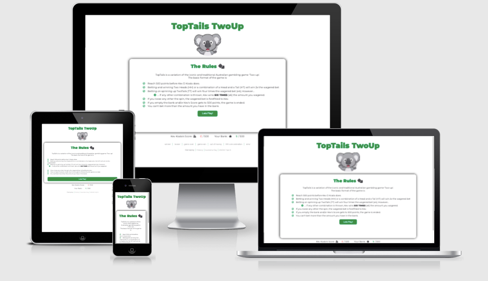
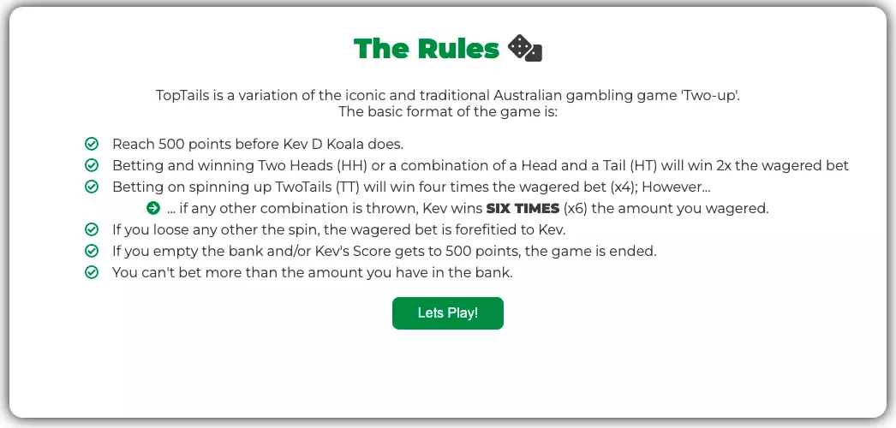
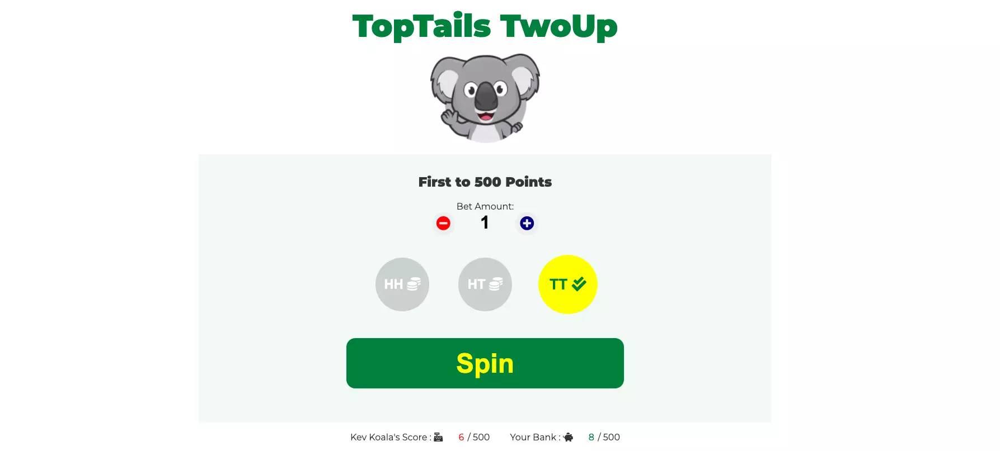
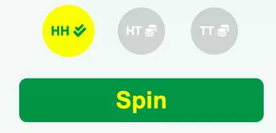

# TopTails TwoUp
### HTML, CSS and JavaScript Essentials - Portfolio Project 2
Site link : https://roeszler.github.io/toptails/

## Table of Contents

1. [Project Purpose](#1-project-purpose)
2. [User Experience Design](#2-user-experience-design)
    * [User Stories](#user-stories)
        * [First Time Visitor Goals](#first-time-visitors)
        * [Returning Visitor Goals](#returning-visitors)
        * [Coding Colleagues](#coding-colleagues)
    * [Design](#design)
        * [Imagery](#imagery)
        * [Fonts](#fonts)
        * [Color Scheme](#color-scheme)
3. [Features](#3-features)
    * [Existing Features](#existing-features)
        * [Splash Screen (Gameplay & Rules)](#splash-screen--rules)
        * [Game Area](#game-area)
        * [Bet Amount Area](#bet-amount-area)
        * [Bet Type Area](#bet-type-area)
        * [Spin Button](#spin-button)
        * [Score Area](#score--bank-balance-area)
        * [Footer](#footer)
        * [PopUps](#popups)
        * [Redord Choices](#choice)
    * [Features Left To Implement](#features-left-to-implement)
4. [Technologies](#4-technologies)
5. [Testing](#5-testing)
    * [Validator Testing](#validator-testing)
    * [Issues and Resolutions](#issues--resolutions)
6. [Deployment](#6-deployment)
7. [Credits](#7-credits)
    * [Content](#content)
    * [Media](#media)
## 1. Project Purpose

The TwoTails website was created as the second part of my project portfolio while styding the [Code Insitute's Full Stack Software Developer course](https://codeinstitute.net/se/full-stack-software-development-diploma/). It has been built from the ground up to extend myself and demonstrate the use of pure JavaScript (vanilla JavaScript), HTML and CSS employing User Centered Design. The site is targeted to those looking to implement similar advanced JavaScript concepts, while also participating in a fun game of chance. 

TopTails is a fully responsive game that allows users to bet, choose and chance their luck at winning against a virtual opponent (Kev the Koala) and beating him to 500 points.  

## 2. User Experience Design

TopTails TwoUp (or TopTails for short) is a site that hopes to convey a variation of the iconic and traditional Australian gambling game 'Two-up' and the rich history that it surrounds. 

As a game of chance, TopTails allows users to betting on the outcome of two pennies 'virtually thrown' in the air. Typically played in conjunction with the Australian national remeberance of the [ANZAC spirit](https://en.wikipedia.org/wiki/Anzac_Day), it also represents a game often played at a period of time Australia first displayed itself as distinctly separate nation on the global stage. You may read more about this [here](https://en.wikipedia.org/wiki/Two-up) (Hold CTRL to open in new tab).
### User Stories
#### First Time Visitors
* As a first time user, I wan't to quickly understand the purpose of the site.
* As a first time user, I wan't to understand the rules of the game.
* As a first time user, I wan't to understand how the game is ended.
* As a first time user, I wan't to identify that it is a game of chance.
* As a first time user, I wan't to be able to selcet chioces in a simple and intuitive way.
* As a first time user, I wan't to inititate the game play in a simple and intutive way.
* As a first time user, I wan't the game to require interaction with me.
* As a first time user, I wan't ways to learn more about the author, topic and history surrounding the game.
* As a first time user, I wan't ways to refer the game to my friends.
#### Returning Visitors
* As a returning user, I wan't to try to beat the computersied opponent (Kev the Koala) to 500 points without breaking the bank.
* As a returning user, I wan't to engage with [game theory](https://en.wikipedia.org/wiki/Game_theory) as a pastime to beat a virtual opponent.

#### Coding Colleagues
* As a fellow code writing user, I wan't to see how the java script has been written and operates.
* As a fellow code writing user, I wan't to be abel to contact the author.
### Design

  The site is intended to convey items commonly used in close association to the Australian land, lifestyle and culture.
#### Imagery

  Australia is commonly associated with the Kangaroo, the Emu (found on its [coat of arms](https://en.wikipedia.org/wiki/Coat_of_arms_of_Australia)) and the Koala in [popular culture](https://www.australiangeographic.com.au/topics/wildlife/2014/08/australias-animal-fauna-emblems/).

  A deliberate focus on the imagery of TopTails is to convey a fun, light and intuetively warming experience to the user. On search of appropriately available imagry, the Koala was chosen based on its often infered 'cuddly' nature. From here, Kevin the Koala was chasen as a name for the opponenet, as it attaches to the site imagery and natural alliteration that occurs from its name.

#### Fonts
Typography was evaluated in line with the sitestyle aiming for a the easy to read, recreational visitor.
* Bold, fun and slightly quirky main headings
* Smooth easy to read content 
* Excellent contrast 
* Adequately convey the light, fun, simple gameplay of site
  
Typography selection process :
* Review of similar and complementary fonts from variety of internet based sources
* Selection of those that seem appropriate to the game design
  * Shortlisted fonts :
    * Alfa Slab / Open Sans
    * Alegreya Sans / Roboto
    * Montserrat / Montserrat

Evaluation based on contrast, easy of reading, and shapes that compliment the Australian nature, the singular font style [Montserrat](https://fonts.google.com/specimen/Montserrat) was selected as the font most suitable. 
    
#### Color Scheme

Based on providing visual depth and variety of events to the game user, the following color pallette has been chosen surrounding the green seen in the [Austalain national colors](https://en.wikipedia.org/wiki/National_colours_of_Australia), bright yellow and flag blue: 

| Primary Color Palette | Hexadecimal Value | RGBA Value  |
| - |:-:| -:|
| Text Gray | #3B3B3F | rgba(59,59,63, 1) |
| Fade Gray | #3B3B3F80 | rgba(59,59,63, 0.5) |
| Inactive Gray | #3B3B3F33 | rgba(59,59,63, 0.2) |
| Australian Green | #00843D | rgba(0,140,60, 1) |
| Fade Australian Green | #00843D80 | rgba(0,140,60, 0.5) |
| Game Area Green | #00843D0D | rgba(0,140,60, 0.05) |
| Australian Flag Blue | #00008B | rgba(0,0,139, 1) |
| Yellow | #ff0 | rgba(255,255,0,1) |
| Red | #FF0000 | rgba(255,0,0,1) |
| White | #FFF | rgba(255,255,255,1) |
| Black | #000 | rgba(0,0,0,1) |
| Silver | #c0c0c0 | rgba(192,192,192,1) |

## 3. Features 

In this section, you should go over the different parts of your project, and describe each in a sentence or so. You will need to explain what value each of the features provides for the user, focusing on who this website is for, what it is that they want to achieve and how your project is the best way to help them achieve these things.

### Existing Features
#### Splash Screen & Rules
  * The first page of the site is intended to ground the user into the objective and game rules.
  * TopTails gameplay is a simplified variation to the original TwoUp rules as described [here](https://en.wikipedia.org/wiki/Two-up#Gameplay).
  * It helps fulfil two user stories: 
    > As a first time user, I wan't to quickly understand the purpose of the site.
    
    > As a first time user, I wan't to understand the rules of the game.

  * It intuitively indicates that a new game has commenced.
  * It provides encouragement to the user to start / restart the game. 

  
#### Game Area
  * This is the main interaction portion of the site. 
  * It contains all sections contained within the body; Heading, Game Area, Score Area and Footer.
  * As an alternative to using `alert()` functions, I have coded functions to simultaneously display events as a [popup](#popups)) and hide the game area. 
    * This has been done to mantain interactivity accross mobile devices and browsers that often block traditional `alert()` style events.
  * The game area holds the multiple points of interaction discussed under the headings follwing.
  * It is bound by a subte green coloration to deliniate the focal points of gameplay and intuitively indicate to the user where to interact with the site.
  * It maintains the prinmary green / yellow color scheme commonly seen in [Australian sports](https://en.wikipedia.org/wiki/National_colours_of_Australia).
  * It also helps the user eye to focus, and is replaced in the exact dimensions with game events ([popups](#popups)).
  * It attends to user stories:
    > As a first time user, I wan't to be able to selcet chioces in a simple and intuitive way.
    
    > As a first time user, I wan't to inititate the game play in a simple and intutive way.
    
    > As a first time user, I wan't the game to require interaction with me.
    
    > As a first time user, I wan't to understand how the game is ended.

#### Bet Amount Area

  * This section is the first point of user interaction.
  * Allows user to increment / decrement the bet amount that simultaneously decreases / icreases the bank area seen as 'Your Bank'.
  * It has been created as an `<input type="number">` tag without the usual increase/decrease arrows that associate with this input. 
    * Altho not conventional, the use of this has permitted
      * Logging of amounts to console, 
      * Direct user input (if so desired),
      * Event listener on the DOMContentLoaded event that fundamentally controls the game, 
      * Simultaneous decreasing of a similar `<input>` tag the Bank Area,
      
      * Base factor to calculate win / loss amounts

  * The ability for the user to choose the wadger attends to user stories:
    > As a returning user, I wan't to try to beat the computersied opponent (Kev the Koala) to 500 points without breaking the bank.
    
    > As a returning user, I wan't to engage with [game theory](https://en.wikipedia.org/wiki/Game_theory) as a pastime to beat a virtual opponent.

    > As a fellow code writing user, I wan't to see how the java script has been written and operates.

#### Bet Type Area
* Inactive State :

* Hover State with `title=""` tag in html to allow information on hover :

* Active State that `enables` the spin button :

#### Spin Button
#### Score & Bank Balance Area
#### Footer
#### PopUps
#### Choice
###

- __The Love Maths Logo and Heading__

  - Featured at the top of the page, the Love Maths logo and heading is easy to see for the user. Upon viewing the page, the user will be able to see the name of the game.

- __The Game Area__

  - This section will allow the user to play the maths game. The user will be able to easily see icons for addition,  subtraction, multiplication, and division games.
  - The user will be able to select the type of maths game they will be playing by clicking on the different icons. 

- __The Question section__

  - The question section is where the user will be able to see the elementary arithmetic question to answer as part of the game. The user will be able answer the questions in the answer box provide
  - The user will be able to submit their answer and a pop-up will make it known to the user if they answered correctly. 

- __The Score Area__

  - This section will allow the user to see exactly how many correct and incorrect answers they have provided. 

For some/all of your features, you may choose to reference the specific project files that implement them.

In addition, you may also use this section to discuss plans for additional features to be implemented in the future:

### Features Left to Implement

- Another feature idea

## 4. Technologies
## 5. Testing 

In this section, you need to convince the assessor that you have conducted enough testing to legitimately believe that the site works well. Essentially, in this part you will want to go over all of your project’s features and ensure that they all work as intended, with the project providing an easy and straightforward way for the users to achieve their goals.

In addition, you should mention in this section how your project looks and works on different browsers and screen sizes.

You should also mention in this section any interesting bugs or problems you discovered during your testing, even if you haven't addressed them yet.

If this section grows too long, you may want to split it off into a separate file and link to it from here.

### Validator Testing 

- HTML
    - No errors were returned when passing through the official [W3C validator](https://validator.w3.org/nu/?doc=https%3A%2F%2Fcode-institute-org.github.io%2Flove-maths%2F)
- CSS
    - No errors were found when passing through the official [(Jigsaw) validator](https://jigsaw.w3.org/css-validator/validator?uri=https%3A%2F%2Fvalidator.w3.org%2Fnu%2F%3Fdoc%3Dhttps%253A%252F%252Fcode-institute-org.github.io%252Flove-maths%252F&profile=css3svg&usermedium=all&warning=1&vextwarning=&lang=en)
- JavaScript
    - No errors were found when passing through the official [Jshint validator](https://jshint.com/)
      - The following metrics were returned: 
      - There are 11 functions in this file.
      - Function with the largest signature takes 2 arguments, while the median is 0.
      - Largest function has 10 statements in it, while the median is 3.
      - The most complex function has a cyclomatic complexity value of 4 while the median is 2.

### Issues & Resolutions

You will need to mention unfixed bugs and why they were not fixed. This section should include shortcomings of the frameworks or technologies used. Although time can be a big variable to consider, paucity of time and difficulty understanding implementation is not a valid reason to leave bugs unfixed. 

## 6. Deployment

This section should describe the process you went through to deploy the project to a hosting platform (e.g. GitHub) 

- The site was deployed to GitHub pages. The steps to deploy are as follows: 
  - In the GitHub repository, navigate to the Settings tab 
  - From the source section drop-down menu, select the Master Branch
  - Once the master branch has been selected, the page will be automatically refreshed with a detailed ribbon display to indicate the successful deployment. 

The live link can be found here - https://roeszler.github.io/toptails/

## 7. Credits 

In this section you need to reference where you got your content, media and extra help from. It is common practice to use code from other repositories and tutorials, however, it is important to be very specific about these sources to avoid plagiarism. 

You can break the credits section up into Content and Media, depending on what you have included in your project. 

### Content 

- The text for the Home page was taken from Wikipedia Article A
- Instructions on how to implement form validation on the Sign Up page was taken from [Specific YouTube Tutorial](https://www.youtube.com/)
- The icons in the footer were taken from [Font Awesome](https://fontawesome.com/)

### Media

- The photos used on the home and sign up page are from This Open Source site
- The images used for the gallery page were taken from this other open source site